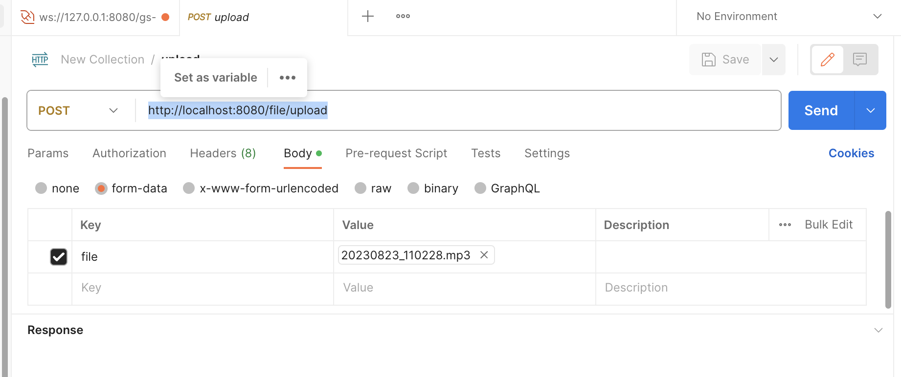
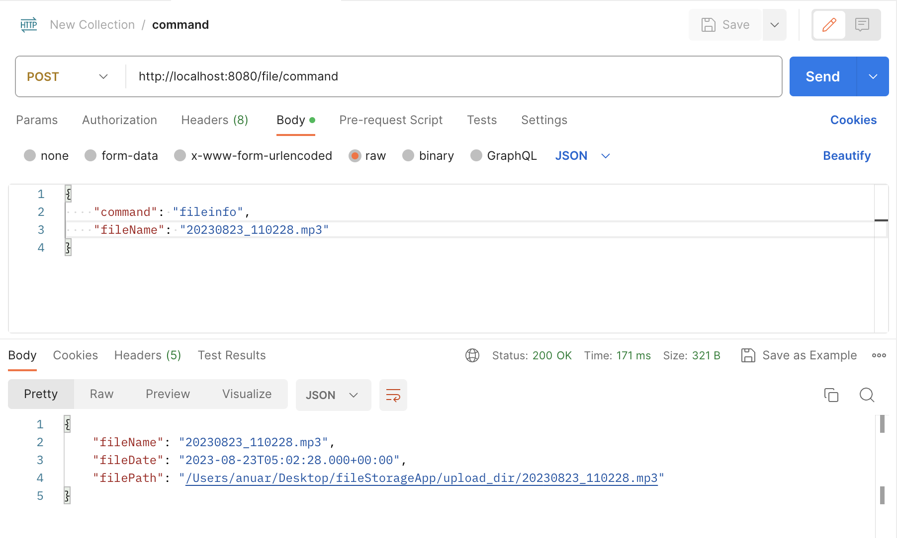
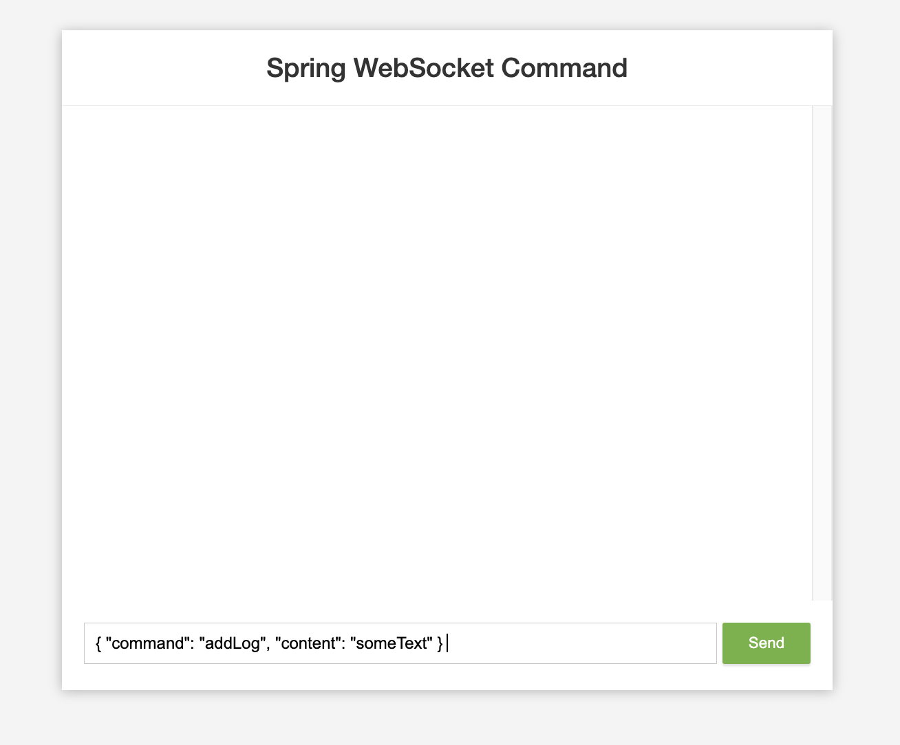
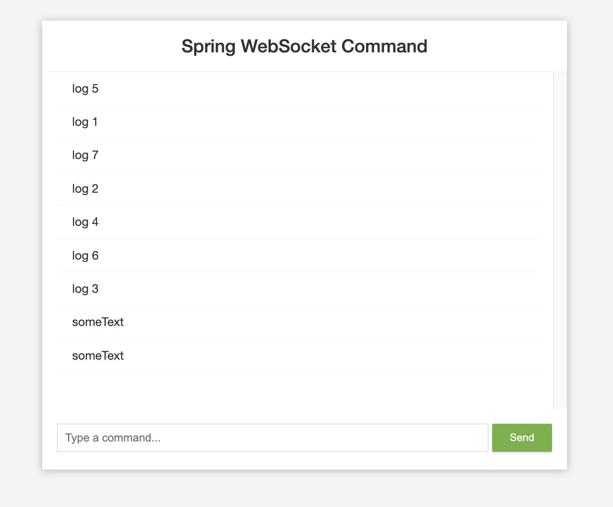

## Rest API

Task #1

| Description   | Endpoints                            | METHOD |
|---------------|--------------------------------------|--------|
| Upload File   | [http://localhost:8080/file/upload]  | POST   |   
| Get File Info | [http://localhost:8080/file/command] | POST   |  

http://localhost:8080/file/upload

http://localhost:8080/file/command

Task #2
## Websocket

| Description      | Endpoints                |
|------------------|--------------------------|
| Add or show log  | [http://localhost:8080 ] |

